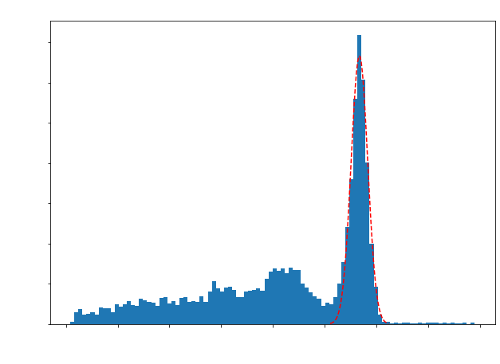

# Read-in data and convert to geometric channel ID


```python
df = getCoincidenceDataFrame('Desktop/BGO_30min_410mm_Run2_coinc.dat')
convertDataFrameToGeoID(df)
```


    0


# Plotting a single channel coincident energy spectrum
- fitted with a gaussian to get energy resolution
- SingleChannelEnergyResponse() purposefully leaves the figure open so we can edit plot aesthetics outside of the function, so after we call the function we set our own labels


```python
Eres = SingleChannelEnergyResponse(df,1415,100)

# here we add labels 
plt.ylabel('Counts',fontsize = 18)
plt.xlabel('Charge in DAQ Units',fontsize = 18)
plt.title('Coincidence Energy Spectrum (Channel 1415)',fontsize = 18)
plt.xticks(fontsize = 14)
plt.yticks(fontsize = 14)

print('The Energy Resolution is ' + str(np.round(Eres,2)) + '%')
```

    The Energy Resolution is 23.64%


    

    


# Plotting Coincidence Time Distribution for a given Channel pair
- fitted with a gaussian to get coincidence time resolution (CTR)
- getCoincidenceTimeDiffs() purposefully leaves the figure open so we can edit plot aesthetics outside of the function, so after we call the function we set our own labels


```python
CTR = getCoincidenceTimeDiffs(df,1415,154,100)

# here we add labels 
plt.ylabel('Counts',fontsize = 18)
plt.xlabel('Time Differences [ps]',fontsize = 18)
plt.title('Time Difference Distribution (Channels 1415 & 154)',fontsize = 18)
plt.xticks(fontsize = 14)
plt.yticks(fontsize = 14)

print('The Coincidence Time Resolution is ' + str(np.round(CTR,2)) + ' ps')
```

    The Coincidence Time Resolution is 2102.7 ps


    

