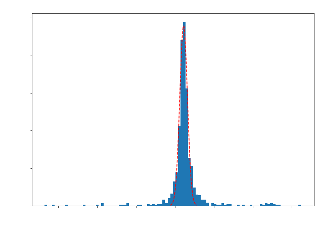

# Experimental PET-Detector Response Code Package:
This python code suite is used to analyze and visualize experimental data outlining the detector response of PET scanners using PETSys readout-electronics. This is an ongoing project and thus far has callable functions to obtain canoncial detector performance parameters such energy resolution and coincidence time resolution as well as visualize their related plots, energy specra and time difference distributions, respectively. Other important analyses functions are currently being worked on. The goal is to eventually publish this as a python package.
- **PETheader.py** contains all technical functions that just have to do with data readin, manipulation, etc
- **detectorResponse.py** contains functions that can be used to generate important plots needed to characterize a detector's performance (e.g., energy spectra, coincidence time differences, etc) as well as their corresponding observables like energy resolution and coincidence timing resolution, respectively.
- **experimentalPETAnalysis.ipynb** is a notebook with cells encompassing PETheader.py and detectorResponse.py as well as example cells directly below.

Below showcases the use of select tools offered by this suite as given in the example cells from experimentalPETAnalysis.ipynb:

## Read-in data and convert to geometric channel ID
- getCoincidenceDataFrame() returns a pre-configured pandas dataframe
- convertDataFrameToGeoID() returns 0 but modifies said dataframe (df in our case) to use geometric channel IDs. 


```python
df = getCoincidenceDataFrame('Desktop/BGO_30min_410mm_Run2_coinc.dat')
convertDataFrameToGeoID(df)
```


    0


## Plotting a single channel coincident energy spectrum
- fitted with a gaussian to get energy resolution
- SingleChannelEnergyResponse() purposefully leaves the figure open so we can edit plot aesthetics outside of the function, so after we call the function we set our own labels


```python
Eres = SingleChannelEnergyResponse(df,1415,100)

# here we add labels 
plt.ylabel('Counts',fontsize = 18)
plt.xlabel('Charge in DAQ Units',fontsize = 18)
plt.title('Coincidence Energy Spectrum (Channel 1415)',fontsize = 18)
plt.xticks(fontsize = 14)
plt.yticks(fontsize = 14)

print('The Energy Resolution is ' + str(np.round(Eres,2)) + '%')
```

    The Energy Resolution is 23.64%


    

    


## Plotting Coincidence Time Distribution for a given Channel pair
- fitted with a gaussian to get coincidence time resolution (CTR)
- getCoincidenceTimeDiffs() purposefully leaves the figure open so we can edit plot aesthetics outside of the function, so after we call the function we set our own labels


```python
CTR = getCoincidenceTimeDiffs(df,1415,154,100)

# here we add labels 
plt.ylabel('Counts',fontsize = 18)
plt.xlabel('Time Differences [ps]',fontsize = 18)
plt.title('Time Difference Distribution (Channels 1415 & 154)',fontsize = 18)
plt.xticks(fontsize = 14)
plt.yticks(fontsize = 14)

print('The Coincidence Time Resolution is ' + str(np.round(CTR,2)) + ' ps')
```

    The Coincidence Time Resolution is 2102.7 ps


    

