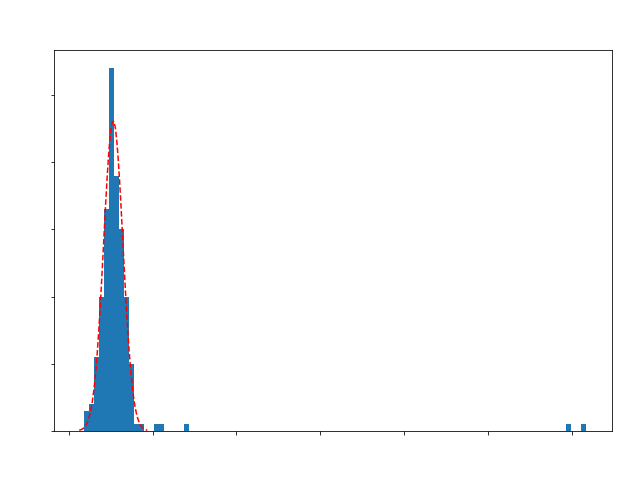

# Experimental PET-Detector Response Code Package:
This python code suite is used to analyze and visualize experimental data outlining the detector response of PET scanners using PETSys readout-electronics. This is an ongoing project and thus far has callable functions to obtain canoncial detector performance parameters such energy resolution and coincidence time resolution as well as visualize their related plots, energy specra and time difference distributions, respectively. Other important analyses functions are currently being worked on. The goal is to eventually publish this as a python package.
- **PETheader.py** contains all technical functions that just have to do with data readin, manipulation, etc
- **detectorResponse.py** contains functions that can be used to generate important plots needed to characterize a detector's performance (e.g., energy spectra, coincidence time differences, etc) as well as their corresponding observables like energy resolution and coincidence timing resolution, respectively.
- **experimentalPETAnalysis.ipynb** is a notebook with cells encompassing PETheader.py and detectorResponse.py as well as example cells directly below.

Below showcases the use of select tools offered by this suite as given in the example cells from experimentalPETAnalysis.ipynb. The data being used below comes from two 16x8 BGO crystal arrays placed in coincidence and irradiated with a 10 $\mu$Ci Na-22 source. BGO has notoriously poor timing resolution, **so the results themselves are poor** as it is. *An eventual goal of this code suite is to write software tailored to optimizing BGO-based detectors by utilizing Cherenkov radiation.*

## Read-in data and convert to geometric channel ID
- getCoincidenceDataFrame() returns a pre-configured pandas dataframe
- convertDataFrameToGeoID() returns 0 but modifies said dataframe (df in our case) to use geometric channel IDs. 


```python
df = getCoincidenceDataFrame('Desktop/BGO_30min_410mm_Run2_coinc.dat')
convertDataFrameToGeoID(df)
```


    0


## Plotting a single channel coincident energy spectrum
- fitted with a gaussian to get energy resolution
- SingleChannelEnergyResponse() purposefully leaves the figure open so we can edit plot aesthetics outside of the function, so after we call the function we set our own labels


```python
Eres = SingleChannelEnergyResponse(df,1415,100)

# here we add labels 
plt.ylabel('Counts',fontsize = 18)
plt.xlabel('Charge in DAQ Units',fontsize = 18)
plt.title('Coincidence Energy Spectrum (Channel 1415)',fontsize = 18)
plt.xticks(fontsize = 14)
plt.yticks(fontsize = 14)

print('The Energy Resolution is ' + str(np.round(Eres,2)) + '%')
```

    The Energy Resolution is 23.64%


    

    


## Plotting Coincidence Time Distribution for a given Channel pair
- fitted with a gaussian to get coincidence time resolution (CTR)
- getCoincidenceTimeDiffs() purposefully leaves the figure open so we can edit plot aesthetics outside of the function, so after we call the function we set our own labels


```python
CTR = getCoincidenceTimeDiffs(df,1415,154,100)

# here we add labels 
plt.ylabel('Counts',fontsize = 18)
plt.xlabel('Time Differences [ps]',fontsize = 18)
plt.title('Time Difference Distribution (Channels 1415 & 154)',fontsize = 18)
plt.xticks(fontsize = 14)
plt.yticks(fontsize = 14)

print('The Coincidence Time Resolution is ' + str(np.round(CTR,2)) + ' ps')
```

    The Coincidence Time Resolution is 2102.7 ps


    


## Plotting Coincidence Time Distribution with photopeak cuts
- here we use SingleChannelEnergyResponse() and getCoincidenceTimeDiffs() together. We call SingleChannelEnergyResponse() twice, once for the left and right channels respectively. 
- In getCoincidenceTimeDiffs() can set photocut to be True and use the return values of SingleChannelEnergyResponse() to cut the left and right channel data to be within 1.5$\sigma$ within their respective photopeaks. 
- This can refine timing distributions to be narrower since this requires the timing differences to come from photoelectric effect events. Once again note that since the scintillator in question here is BGO, the photopeak cut is not particularly powerful, however, with a scintillator with a fast decay constant like LYSO, photopeak cuts will improve CTR tremendously.


```python
leftchannel = 1415
rightchannel = 154
bins = 100
sigma_cut = 2

Eres_left,photopeakcut_left = SingleChannelEnergyResponse(df,leftchannel,bins,sigma_cut)
plt.close() # we visalized this above, so let's close the figure to save memory
Eres_right,photopeakcut_right = SingleChannelEnergyResponse(df,rightchannel,bins,sigma_cut)
plt.close()

# create our list of left and right photopeakcuts, should go [leftcuts,rightcuts]
photopeakcutList = [photopeakcut_left,photopeakcut_right] 

# plot the cut timing distribution!
CTR_with_photopeakcuts = getCoincidenceTimeDiffs(df,leftchannel,rightchannel,100,photocut=True,photopeakcuts = photopeakcutList)
plt.ylabel('Counts',fontsize = 18,color = 'white')
plt.xlabel('Time Differences [ps]',fontsize = 18,color = 'white')
plt.title('Time Difference Distribution (Channels 1415 & 154)\n' + '2$\sigma$ photopeak cut',fontsize = 18,color = 'white')
plt.xticks(fontsize = 14,color = 'white')
plt.yticks(fontsize = 14,color = 'white')

print('The Coincidence Time Resolution is ' + str(np.round(CTR_with_photopeakcuts,2)) + ' ps')
```

    The Coincidence Time Resolution is 2102.7 ps


    

